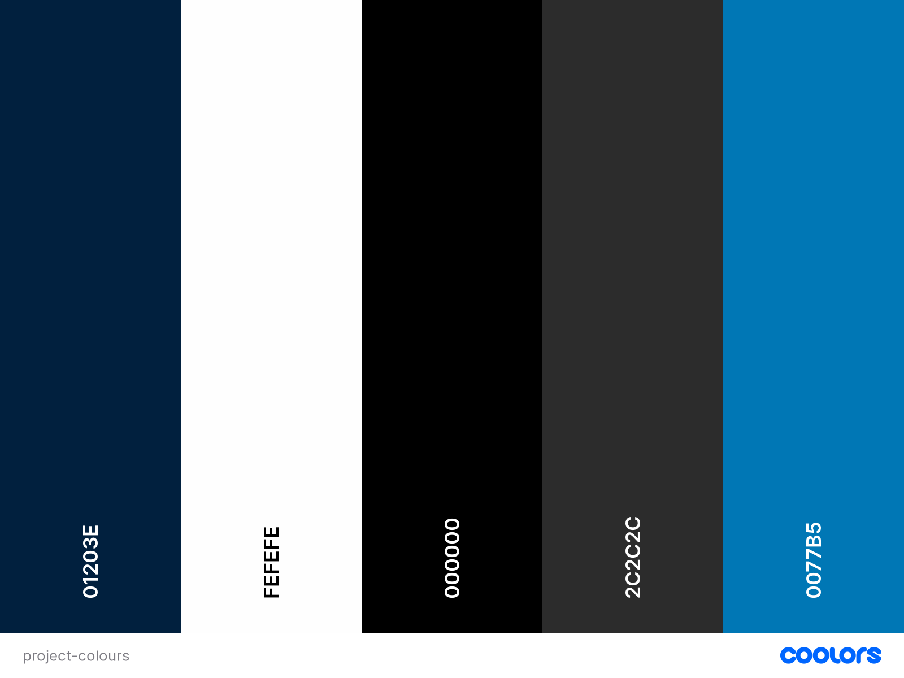

# Electrician Website

This is a website desinged to give a fictional Electrician Company an online presence.

## UX

### Project Goals

The main aim is to give customers contact information to get more business, while also trying to attract new clients by giving them the chance to see who the company are and what they can do.

Although fictional, the project is a representative example of a real-world business trying to reach out to new clients and maintain profitability.

The target audience is anyone who needs electrical work doing.

#### Customer goals

* Get any information needed quickly and easily.
* Enjoyable experiance on the site.
* See that the company is competent and professional.
* Find out what other customers thought about the company.
* Easy to fill in contact form. 

#### Business goals

* Get more customers, more business.
* Look professional and competent.
* Improved company reputation.

#### Developer goals

* Create a clean responsive static website for milestone project.
* Make information easy to find.
* An easy to navigate site. 
* A project that would be good enough to go in a portfolio.

## Design Choices

#### Fonts

* The fonts used were taken from [Google Fonts](https://fonts.google.com/)
* The fonts Roboto and Lato were used because they are popular and therefore more recognisable.
* The font sans-serif was put in as a back up.

#### Icons

* Icons used were taken from [Font awesome](https://fontawesome.com/)
* All icons used were chosen because they are easily recognisable to clients.

#### Colours

* I used a colour picker extension built in to the browser to identify useful colours.
* The primary colour choices of dark blue and white were chosen because they have a clean clear aspect while contrasting well with each other.
* Black and Grey were chosen to make the writing stand out against the background.
* Most colours used were taken from the logo or image from the home page.
* The light blue was taken from facebook homepage and used because it is a recognisable social media colour.

#### Styling

* [Bootstrap](https://getbootstrap.com/) was used throughout the project for its built in styling capabilities.
* The same header/nav bar and footer used on each page for easy navigation.
* Hover added on the main elements.
* Different certificates added at different stage of responsive design so always visible to the clients.
* Clickable links open in a new page.

#### Backgrounds

* Home page background image used as an easy recognisable company van.
* About page background image used as a friendly face.
* Contact page background image used to showcase someone working.

## Wireframes

* Wireframes for the project were developed after the idea was scribbled on a piece of paper, the program used being Balsamiq.

* 

## Installation

To clone this project into Github you will need:

1. A Github account.
2. Install the Gitpod extension.
3. Log into Gitpod with your Github account.
4. On the GitHub website find and click on the [Github repository](https://github.com/CHRISHA1122/milestone-project-1) of intrest.
5. Locate the green button named Gitpod in the top right corner of the repository and click on it,
6. This will trigger a new Gitpod workspace to be created from the code in Github where you can work locally.

## Deployment

This project was developed using Gitpod, commited to Git and pushed to Github using it's built in function.

To deploy this page to Github pages from its [Github repository](https://github.com/CHRISHA1122/milestone-project-1),
the following steps were taken:

1. Log into Github.
2. From the list of repositorieson the screen select [CHRISHA1122/milestone-project-1](CHRISHA1122/milestone-project-1)
3. On the menu item go to Settings.
4. Scroll down and select Pages.
5. Under "Source" click the drop-down menu labelled "None" and select "Main".
6. Upon selection, the page will automatically refresh meaning that the website is now deployed.
7. Scroll back down to the "Pages" section to retrieve the deployed link.