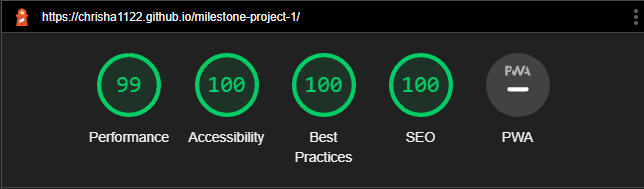
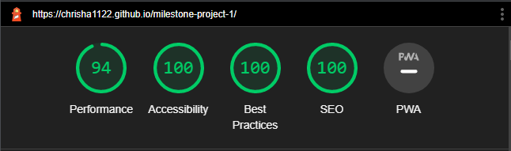

# Electrician Website

[View the live site here](https://chrisha1122.github.io/milestone-project-1/)

This is a website desinged to give a fictional Electrician Company an online presence.

## Table of Contents

- [**Project Goals**](#project-goals)
 - [Customer Goals](#customer-goals)
 - [Business goals](#business-goals)
 - [Developer goals](#developer-goals)

- [**User Experience UX**](#user-experience-ux)
 - [Design Choices](#design-choices)
 - [Fonts](#fonts)
 - [Icons](#icons)
 - [Colours](#colours)
 - [Styling](#styling)
 - [Images](#images)

- [**Wireframes**](#wireframes)
 - [Homepage Wireframe](#homepage-wireframe)
 - [Aboutpage Wireframe](#aboutpage-wireframe)
 - [Contactpage Wireframe](#contactpage-wireframe)

- [**Features**](#features)
 - [Header](#header)
 - [Footer](#footer)
 - [Homepage Content](#homepage-content)
 - [About Content](#about-content)
 - [Contact Content](#contact-content)
 - [Map](#map)
 - [Main Page](#main-page)

- [**Technologies**](#technologies)
 - [Languages](#languages)
 - [Frameworks](#frameworks)

- [**Testing**](#testing)
 - [Browsers](#browsers)
 - [Mobile](#mobile)
 - [HTML Validator](#html-validator)
 - [CSS Validator](#css-validator)

- [**Installation**](#installation)
- [**Deployment**](#deployment)

- [**Credits**](#credits)
 - [Code](#code)
 - [Images](#images)
 - [Text](#text)

- [**Acknowledgements**](#acknowledgements)

## Project Goals

The main aim is to give customers contact information to get more business, while also trying to attract new clients by giving them the chance to see who the company are and what they can do.

Although fictional, the project is a representative example of a real-world business trying to reach out to new clients and maintain profitability.

The target audience is anyone who needs electrical work doing.

### Customer goals

* Get any information needed quickly and easily.
* Enjoyable experiance on the site.
* See that the company is competent and professional.
* Find out what other customers thought about the company.
* Easy to fill in contact form. 

### Business goals

* Get more customers, more business.
* Look professional and competent.
* Improved company reputation.

### Developer goals

* Create a clean responsive static website for milestone project.
* Make information easy to find.
* An easy to navigate site. 
* A project that would be good enough to go in a portfolio.

## User Experience - UX

### Design Choices

#### Fonts

* The fonts used were taken from [Google Fonts](https://fonts.google.com/)
* The fonts Roboto and Lato were used because they are popular and therefore more recognisable.
* The font sans-serif was put in as a back up.

#### Icons

* Icons used were taken from [Font awesome](https://fontawesome.com/)
* All icons used were chosen because they are easily recognisable to clients.

#### Colours

* I used a colour picker extension built in to the browser to identify useful colours.
* The primary colour choices of dark blue and white were chosen because they have a clean clear aspect while contrasting well with each other.
* Black and Grey were chosen to make the writing stand out against the background.
* Most colours used were taken from the logo or image from the home page.
* The light blue was taken from facebook homepage and used because it is a recognisable social media colour.

#### Styling

* [Bootstrap](https://getbootstrap.com/) was used throughout the project for its built in styling capabilities.
* The same header/nav bar and footer used on each page for easy navigation.
* Hover added on the main elements.
* Different certificates added at different stage of responsive design so always visible to the clients.
* Clickable links open in a new page.
* Alt text and aria labels added on certain elements.

#### Images

* Images were taken from a mix of [Google Images](https://images.google.com/) and [Unsplash](https://unsplash.com/).
* Certificate images taken from [Brands of the world]([Google Images](https://images.google.com/))
* All images used credited in the credits section.
* Appropriate images given alt or aria labels.

## Wireframes

Wireframes for the project were developed after the idea was scribbled on a piece of paper, the program used being Balsamiq.

### Homepage Wireframe

### Aboutpage Wireframe

### Contactpage Wireframe

## Features

The Eletrician website is designed to strictly adhere to accessibility guidelines across all pages, with easy navigation between sections/pages. Device responsiveness approach taken throughout project. 

### Header

* The header/navbar with a built in hamburger button was taken from [Bootstrap](https://getbootstrap.com/), then changed to suit needs. 
* Added the company name to the left, which when clicked takes the user back to the home screen.
* Home, About and Contact links added in the middle.
* A contact number for the company on the right. 
* All styled in style.css file, with each having hover.
* The header was also made to always stick at the top of the page for easy navigation.

### Footer

* Added the company logo to the left to mimic the header and made a clickable link that takes the user back to the homepage. 
* The middle section was used to give more contact information to the user that is easy to access.
* The final section was used for the company social media links using [Font awesome](https://fontawesome.com/) that when clicked would open in a new page.
* Added a note where the copywrite material should be indicating that this site is for educational use only.

Both the header/navbar and footer were copy and pasted to all pages so as to give the user the same easy navigation through out the site.

### Homepage Content

* The main image was chosen as an easy recognisable company van, credit given in the credits section.
* [Bootstrap](https://getbootstrap.com/) was uesd again here for the rounded circle effect on the certificates that are over the main image also to give them a display property to hide on smaller screen sizes.

 * The main certificate that is visable on all screen sizes is a clickable link that opens in a new page and takes the user to NICEIC website.

### About Content

* The main image was chosen as a friendly looking worker, credit given in the credits section.
* The text content for the about us and testimonials section was taken from two other websites and mixed/changed around to give the page some content, credit given in credits section.
* Added an opaque box around the text so on bigger devices the image can still be seen in the background and on smaller devices the text appears under the image.

### Contact Content

* The main image was chosen to show someone working, credit given in the credits section.
* The contact information section was mainly taken from the homepage image so as to match.
* The address was used because the company name matched in the local area.
* The form section was taken from [Bootstrap](https://getbootstrap.com/) and modified for this webpage.

### Map

* The map is interactive and uses google api, and is directly beneath the contact information and form.
* It provides the user with the location of the business.
* The current map location was choosen for example and only because the company name matched.

### Main Page

* After About and Contact pages were created, added them by copy and pasting into the Home page so as to have one long scrolling main page for better user experiance.

## Technologies

### Languages

This project was built using HTML5 and CSS3. A Javascript link from [Bootstrap](https://getbootstrap.com/) was also added for the hamburger button on the navbar.

### Frameworks

Here is a list of the following technologies used in this project:

- [HTML5](https://en.wikipedia.org/wiki/HTML5)
HTML 5 was used to create the structure of the website
- [CSS3](https://en.wikipedia.org/wiki/CSS)
CSS 3 was used to style the website.
- [GitHub](https://github.com/)
GitHub was used to store the projects code.
- [Gitpod](https://gitpod.io/)
Gitpod terminal was used to commit my code using Git and push it to Github.
- [Balsamiq](https://balsamiq.com/)
Balsamiq was used to design the wireframes for the project.
- [Bootstrap](https://getbootstrap.com/)
Bootstrap was used throughout the project at different stages.
- [Font awesome](https://fontawesome.com/)
Font awesome was used for all icons on the project. 
- [Am I Responsive](https://ui.dev/amiresponsive)
Am I responsive was used to ensure the website is responsive on all devices.

## Testing

### Browsers

Developer tools on Firefox and Google Chrome were used throughout the project.
The website was tested on three different browsers with no problems:

* Microsoft Edge
* Google Chrome
* Mozila Firefox

### Mobile

Developer tools on Firefox and Google Chrome were used throughout the project to check site responsiveness.
Checked the website on my own mobile and other family members devices no problems reported.

* Iphone
* Samsung Galaxy

### HTML Validator

HTML Validator using [W3C Validation](https://validator.w3.org/) confirms no errors or warnings.

### CSS Validator

CSS Validator using [W3C Validation](https://jigsaw.w3.org/css-validator/) confirms no errors found.

## Installation

To clone this project into Github you will need:

1. A Github account.
2. Install the Gitpod extension.
3. Log into Gitpod with your Github account.
4. On the GitHub website find and click on the [Github repository](https://github.com/CHRISHA1122/milestone-project-1) of intrest.
5. Locate the green button named Gitpod in the top right corner of the repository and click on it,
6. This will trigger a new Gitpod workspace to be created from the code in Github where you can work locally.

## Deployment

This project was developed using Gitpod, commited to Git and pushed to Github using it's built in function.

To deploy this page to Github pages from its [Github repository](https://github.com/CHRISHA1122/milestone-project-1),
the following steps were taken:

1. Log into Github.
2. From the list of repositorieson the screen select [CHRISHA1122/milestone-project-1](CHRISHA1122/milestone-project-1)
3. On the menu item go to Settings.
4. Scroll down and select Pages.
5. Under "Source" click the drop-down menu labelled "None" and select "Main".
6. Upon selection, the page will automatically refresh meaning that the website is now deployed.
7. Scroll back down to the "Pages" section to retrieve the deployed link.

## Credits

### Code

* [Code Institute](https://codeinstitute.net) what i've learned from the learning material.
* [Bootstrap](https://getbootstrap.com/) for it's built in functionality.

### Images

* Homepage image and Contactpage image both taken from Google images 
* [Visit site here](https://www.elec-inn.co.uk/)
* Aboutpage image taken from Unsplash 
* [Visit site here](https://unsplash.com/)
* Certificates images taken from Brands of the world
* [Visit site here](https://www.brandsoftheworld.com/)
* Company Logo taken from Google images
* [Visit site here](https://www.dreamstime.com/)

### Text

* About us and Testimonials text content was a mix taken from two websites.
* [Visit site here](https://www.loganselectrics.co.uk/)
* [Visit site here](https://www.harveyelectricalservices.com/)

## Acknowledgements

